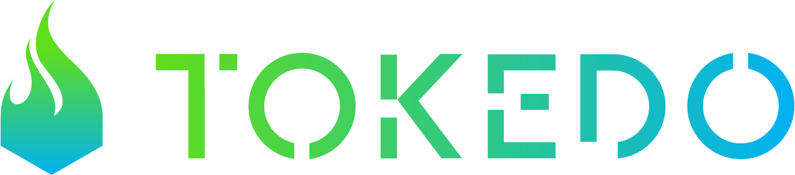
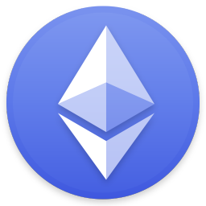

<div>
 <p align="center">
<a href="https://tokedo.io/" target="_blank">

</a>
</p>
</div>


<br>
<p align="center">
The Tokedo Token Creator is a standalone client application that allows you to build all the smart contracts required for a token sale, even without knowing anything about smart contract development.
<br/>
From the issuance of an ERC20/ERC223 standard token to the launch of an ICO, our software has got you covered.
<br/>
You don’t need to know how to program a smart contract to create your token and token sales.
<br/> 
The Token Creator takes care of all the technical subtleties, leaving you the possibility to customize your token and your token sales as you please.
</p>


<br>
<p align="center" style="font-size: 12px;">
Token Creator uses 
<a href="https://www.ethereum.org/" target="_blank">Ethereum Blockchain</a>, 
<a href="https://reactjs.org/" target="_blank">React.js</a>,
<a href="https://redux.js.org/" target="_blank">Redux</a>, 
<a href="https://github.com/reactjs/react-router">React Router</a>, 
<a href="https://metamask.io/" target="_blank">Metamask</a> and 
<a href="https://atomax.io/" target="_blank">Atomax Wallet</a> 
for rapid application development.
</p>


<p align="center">
<a href="https://www.ethereum.org/" target="_blank">

</a>
<a  href="https://reactjs.org/" target="_blank">

</a>
<a href="https://redux.js.org/" target="_blank">

</a>
<a href="https://metamask.io/" target="_blank">

</a>
<a href="https://atomax.io/" target="_blank">

</a>
<a href="https://html.com/" target="_blank">

</a>
</p>


<hr>
<br>
<h6 align="center"> 
Use Tokedo Token Creator either in 
<a href="https://creator.tokedo.io/" target="_blank">Mainnet</a> 
or in  
<a href="https://creator-test.tokedo.io" target="_blank">Testnet</a>
</h6> 
<br>

<p align="center">
  
</p>


## Install

- **Clone the repo with HTTPS**

Use Git with the web URL:

```bash
git clone https://github.com/TOKEDO-project/token-creator.git
```
- **OR Clone the repo with SSH**
 
Use an SSH key and passphrase from account:
```bash
git clone git@github.com:TOKEDO-project/token-creator.git
```
- **Install dependencies with npm.**

```bash
$ cd token-creator
$ npm i
```


## Run

Start the app in the `dev` environment.

```bash
$ npm run dev
```
:bulb: If browser doesn't open automatically, then go to your browser and type the url http://0.0.0.0:8080.


## Modify .env file

- **Ganache**

For making tests in <a href="https://truffleframework.com/docs/ganache/quickstart" target="_blank">Ganache</a> environment in local blockchain, insert the value in the .env file:

```bash
PRIVATE_KEY=0x...
```
- **Select Network**

Insert in which network you want to use the project:

You can select <a href="http://ethdocs.org/en/latest/network/connecting-to-the-network.html#the-ethereum-network" target="_blank">Ropsten</a> Network
```bash
NET=ropsten
```

or <a href="http://ethdocs.org/en/latest/network/connecting-to-the-network.html#the-ethereum-network" target="_blank">Mainnet</a> Network
```bash
NET=main
```
:bulb: Use Ropsten for testing


## How to use Token Creator

⚠️ Install metamask in your browser or download Atomax wallet for <a href="https://itunes.apple.com/us/app/atomax-wallet-lite/id1415885195" target="_blank">ios</a> or 
<a href="https://play.google.com/store/apps/details?id=com.atomax_wallet" target="_blank">android</a>. ⚠️

For more details please visit our <a href="https://github.com/TOKEDO-project/token-creator/blob/master/README_Help.md" target="_blank">help page</a> .


## Maintainers

- <a href="https://github.com/gabrielem" target="_blank">Gabriele Marazzi</a>
- <a href="https://github.com/giuliodisano" target="_blank">Giulio Di Sano</a>
- <a href="https://github.com/ado-ado" target="_blank">Adolfini Asmani</a>
- <a href="https://github.com/Loller79" target="_blank">Dario Sechi</a>
- <a href="https://github.com/Mikepicker" target="_blank">Michele Rullo</a>
- <a href="https://github.com/linosorice" target="_blank">Pasqualino Sorice</a>


## News

Keep up with our news! Check out our <a href="https://blog.tokedo.io/" target="_blank" >[Tokedo Blog]</a>


## Sponsors

Become a sponsor and get your logo on our README on Github with a link to your site. <a href="https://t.me/tokedoproject" target="_blank" >[Become a sponsor]</a>

<a href="https://t.me/tokedoproject" target="_blank"></a>


## Social

<p align="center">Join us on:</p>

<p align="center">
<a href="https://t.me/tokedoproject" target="_blank">
  
  </a>
<a href="https://twitter.com/tokedoproject" target="_blank">
  
  </a>
 <a href="https://www.facebook.com/tokedoproject/" target="_blank">
   
  </a>
</p>

